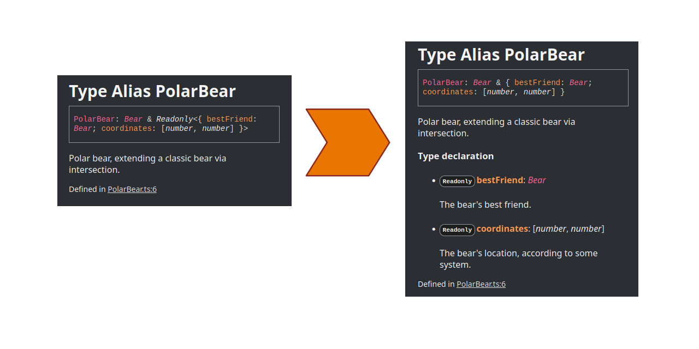

# typedoc-readonly

_Advanced support for Readonly in TypeDoc_

[](https://www.npmjs.com/package/@giancosta86/typedoc-readonly)

**typedoc-readonly** is a plugin for [TypeDoc](https://typedoc.org/) dedicated to _generating more fine-grained documentation_ for _type aliases_ based on TypeScript's [Readonly<>](https://www.typescriptlang.org/docs/handbook/utility-types.html#readonlytype), as you can notice from this image:



## Installation

1. Of course, `typedoc` is a fundamental prerequisite.

1. Then, you'll need to install the plugin package (usually, as a _dev dependency_) for your project:

   > @giancosta86/typedoc-plugin

1. Finally, the plugin itself must be loaded into TypeDoc - for example, by adding this property to TypeDoc's configuration object:

   ```typescript
   {
     plugin: ["@giancosta86/typedoc-readonly"],
   }
   ```

And that's all! TypeDoc will start generating more elegant documentation for your immutable types! 🥳

## How it works

### Basic rules

Whenever the plugin finds a `type` alias based on `Readonly<>` wrapping a type literal, as in:

```typescript
/**
 * Plain, simple immutable type literal.
 */
export type Dodo = Readonly<{
  /**
   * The dodo's name.
   */
  name: string;

  /**
   * The dodo's age, in years.
   */
  years: number;
}>;
```

the declaration will be converted as if it were written like this:

```typescript
/**
 * Plain, simple immutable type literal.
 */
export type Dodo = {
  /**
   * The dodo's name.
   */
  readonly name: string;

  /**
   * The dodo's age, in years.
   */
  readonly years: number;
};
```

As a consequence, TypeDoc will expand each property's description (if provided) - decorating it with a **Readonly** label.

On the other hand, `Readonly<>` wrappers around type names are left unaltered:

```typescript
export type Bear = Readonly<MutableBear>;
```

### Advanced rules

The algorithm also applies to **intersection types**; for example:

```typescript
export type PolarBear = Bear &
  Readonly<{
    /**
     * The bear's location, according to some system.
     */
    coordinates: [number, number];

    /**
     * The bear's best friend.
     */
    bestFriend: Bear;
  }>;
```

will be documented as if it were declared:

```typescript
export type PolarBear = Bear & {
  /**
   * The bear's location, according to some system.
   */
  readonly coordinates: [number, number];

  /**
   * The bear's best friend.
   */
  readonly bestFriend: Bear;
};
```

The same applies, of course, to **union types**:

```typescript
export type YellowstoneAnimal =
  | PolarBear
  | Chipmunk
  | Readonly<{
      /**
       * The generic name for the animal.
       */
      genericName: string;
    }>;
```

will be interpreted like this:

```typescript
export type YellowstoneAnimal =
  | PolarBear
  | Chipmunk
  | {
      /**
       * The generic name for the animal.
       */
      readonly genericName: string;
    };
```

Finally, it is interesting to note that _the algorithm operates recursively_ - for instance, reducing:

```typescript
export type Chipmunk = Readonly<
  Readonly<
    Readonly<{
      /**
       * The chipmunks's name.
       */
      name: string;

      /**
       * The chipmunk's age, in years.
       */
      years: number;
    }>
  >
>;
```

to:

```typescript
export type Chipmunk = {
  /**
   * The chipmunks's name.
   */
  readonly name: string;

  /**
   * The chipmunk's age, in years.
   */
  readonly years: number;
};
```

For additional details about how the plugin internally works, you might want to set TypeDoc's `logLevel` to **Verbose**.

## Further references

- [TypeDoc](https://typedoc.org/) - converts comments in TypeScript's source code into documentation

- [Readonly<>](https://www.typescriptlang.org/docs/handbook/utility-types.html#readonlytype) - constructs a type with all properties of Type set to `readonly`
